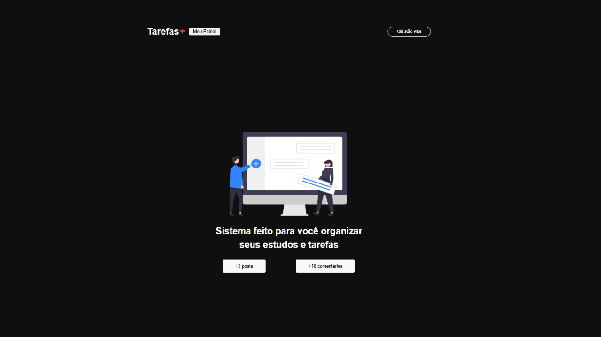
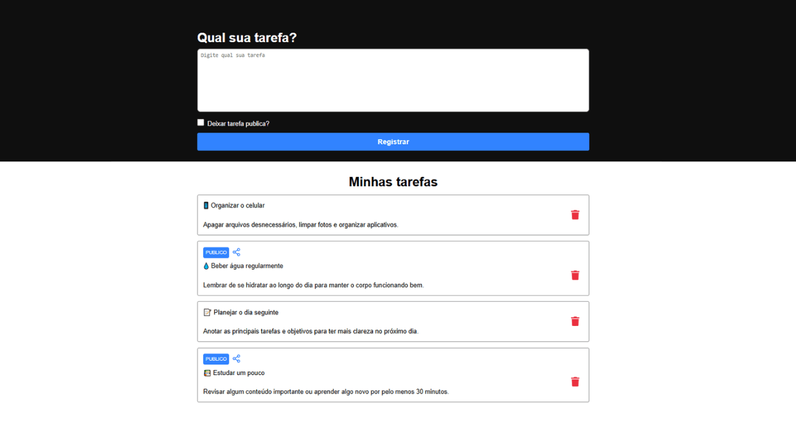

# Tarefas Plus


---

## Sobre o projeto

Este projeto é uma aplicação desenvolvida com **Next.js** com foco em aprendizado prático do ecossistema React com renderização híbrida. A aplicação explora conceitos como **SSR (Server Side Rendering)**, **SSG (Static Site Generation)**, rotas baseadas em arquivos, autenticação de usuários com Google utilizando **NextAuth.js** e integração com banco de dados em tempo real utilizando **Firebase**.

O objetivo principal é evoluir o conhecimento no framework através da construção de páginas, testes e experimentações com boas práticas de desenvolvimento.


## Layout

<p align="center">
  
</p>

<p align="center">
  
</p>

---

## Tecnologias utilizadas

O projeto foi desenvolvido com as seguintes tecnologias:

* **Next.js** — Framework React com SSR e SSG
* **React** — Biblioteca para construção de interfaces
* **Node.js** — Ambiente de execução do Next.js
* **NextAuth.js** — Autenticação com Google (OAuth) 
* **Firebase** — Banco de dados e serviços backend (Firestore)
* **CSS Modules** — Estilização com escopo local
* **npm / yarn** — Gerenciamento de dependências

---

## Funcionalidades

* Autenticação de usuários com Google (NextAuth.js)  
* Proteção de rotas baseada em login  
* Estrutura de páginas com rotas automáticas do Next.js
* Renderização com SSR e SSG
* Organização de componentes reutilizáveis
* Integração com Firebase Firestore para armazenamento de tarefas e comentários
* Estilização com CSS Modules
* Página de tarefas (exemplo prático)
* Estrutura preparada para APIs internas (`/api`)

---

## Como rodar o projeto

### Pré-requisitos

* [Node.js](https://nodejs.org/) (versão LTS)
* [Git](https://git-scm.com/)

---

### 📥 Clonando o repositório

```bash
git clone https://github.com/jotavitorz/tarefas-plus.git
cd tarefas-plus
```

---

### Instalando dependências

```bash
npm install
# ou
yarn
```

---

### Executando o projeto

```bash
npm run dev
```

O projeto será iniciado em:

```
http://localhost:3000
```

---

### Build para produção

```bash
npm run build
npm start
```

## Contribuições & Observações

Fique à vontade para estudar, modificar e evoluir este projeto.

* Utilize boas práticas de commits
* Organize bem os componentes
* Use como base para projetos maiores

Projeto voltado para aprendizado e evolução contínua.

---

<p align="center">
  Feito por <b>João Vitor 🖖</b> 
</p>
